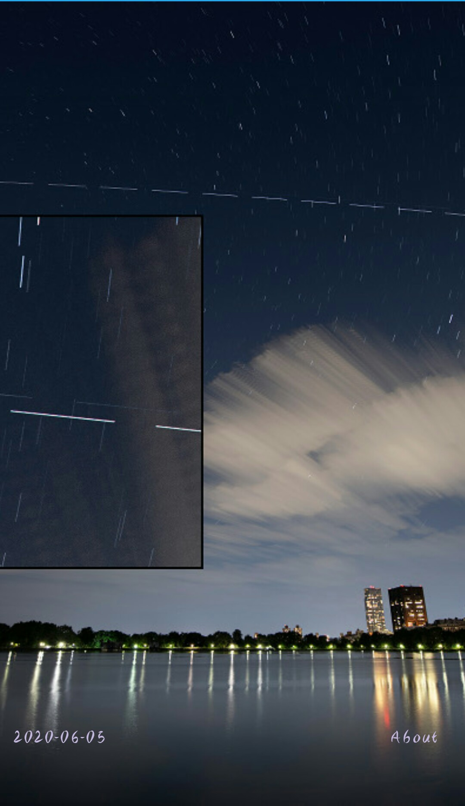
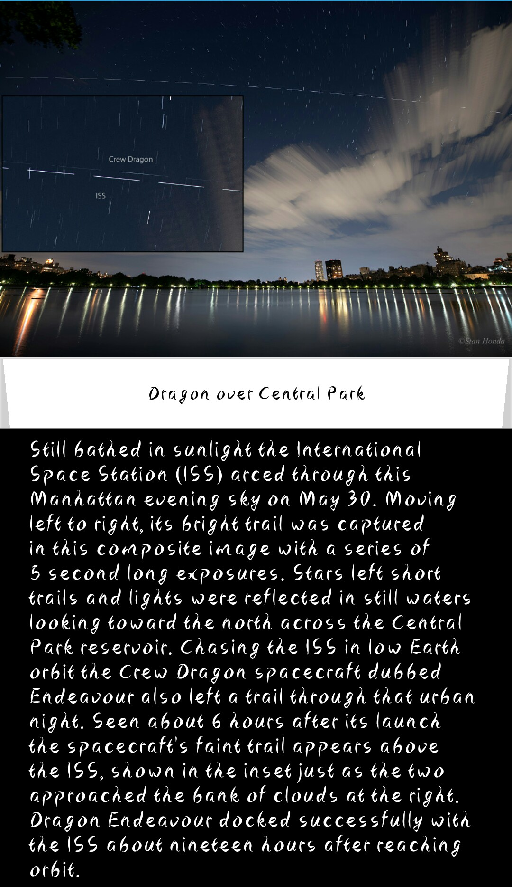
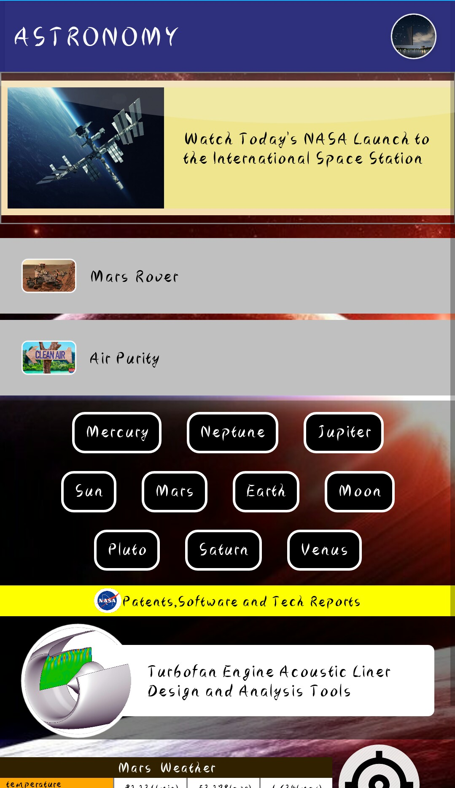
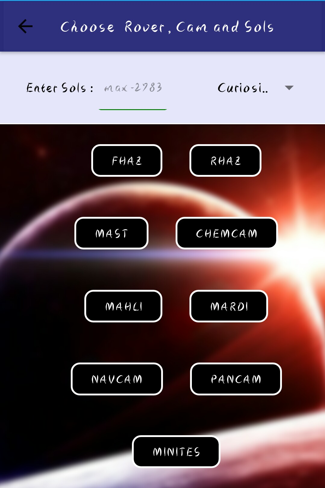
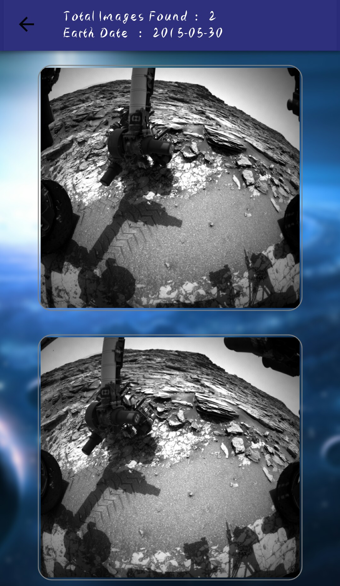
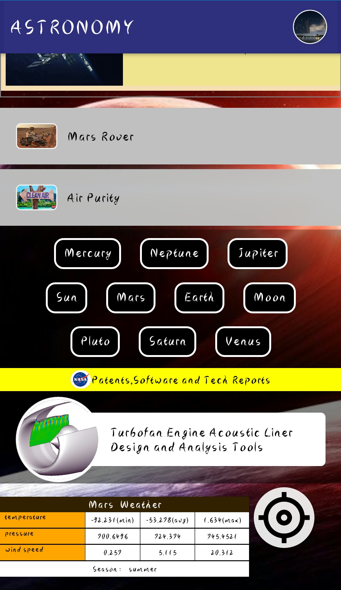
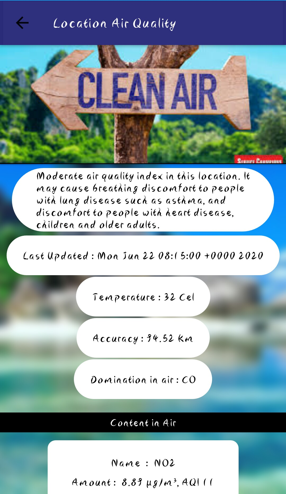
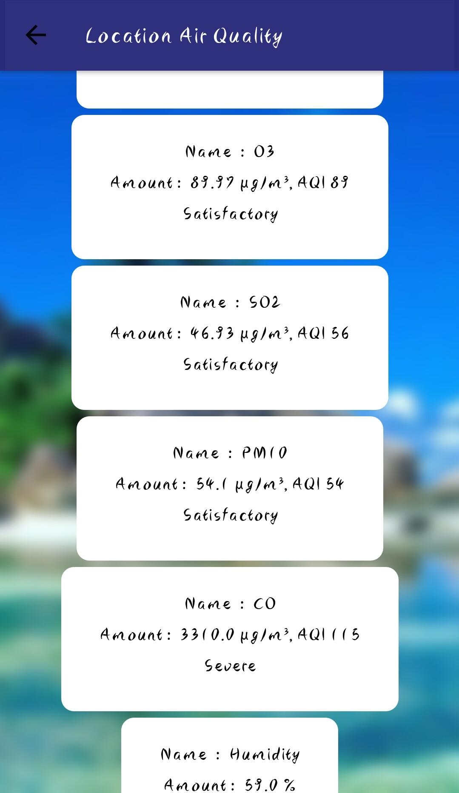
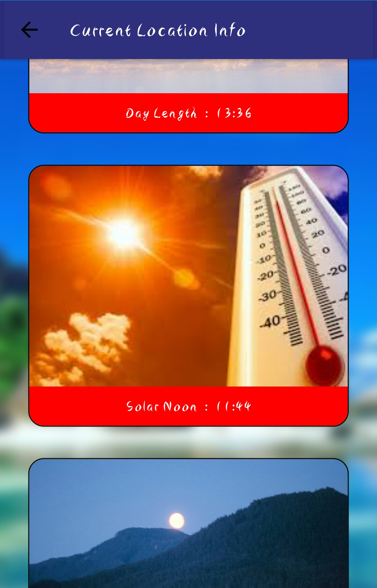
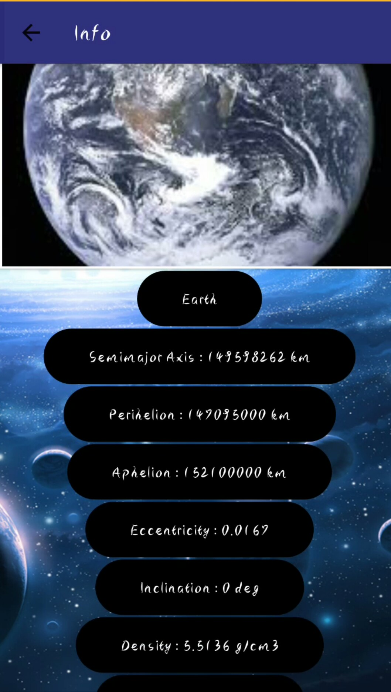

# Nasa-Open-Sources
This app has multiple function and uses Nasa Open Source Apis , News Api , Air Purity Api -----

### Shows Astronomy Image of the day published by Nasa.

***

### News Related to Space,Nasa,Hubble etc.

***

### Images taken by Rover Spirit,Oppurtinity and Curiosity in Mars filtered by types of camera and the captured day of the Picture.

***

### Patents,Software and Tech developed and Shared by Nasa.

***

### Current Mars Weather.

***
### Air Quality of Your current Location.

***

### Sun Rise,Sun set,Moon rise,moon set ,latitude & longitude etc of your current Location.

***

### Planets of our Solar System

***

Link to the App:
https://play.google.com/store/apps/details?id=com.astroben10
